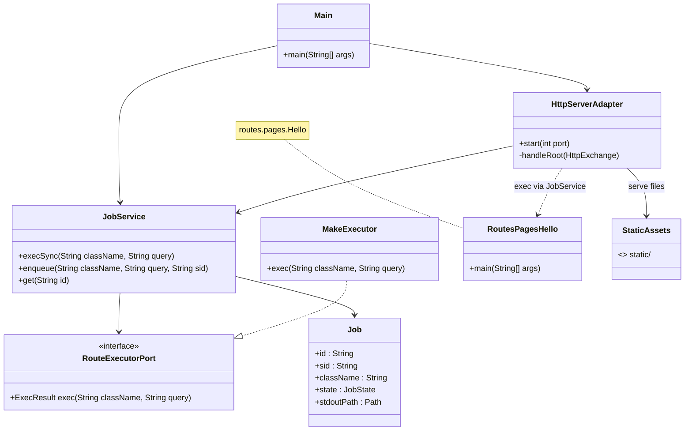
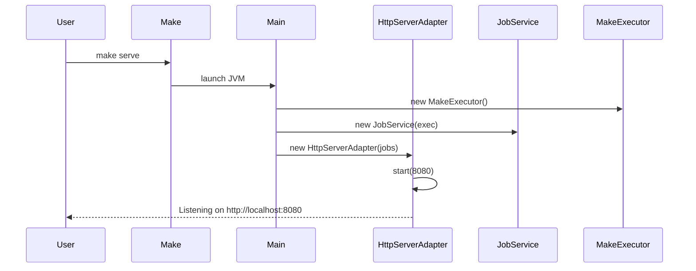
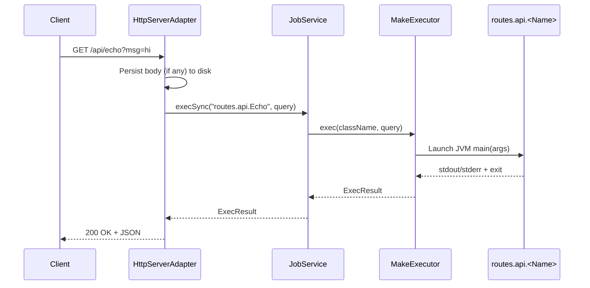
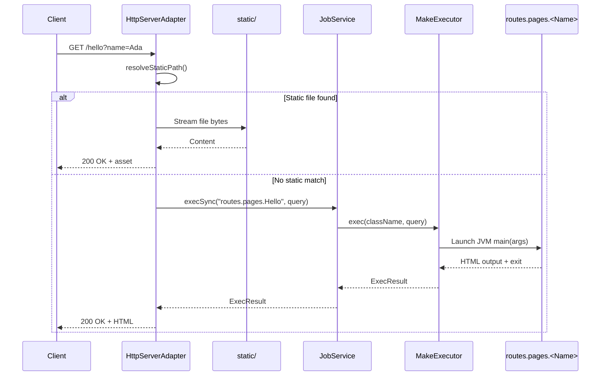
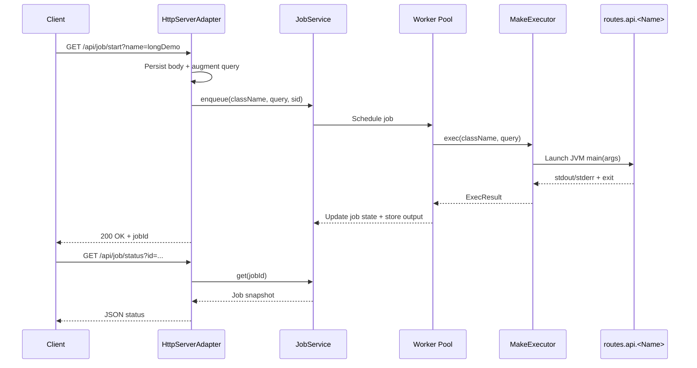
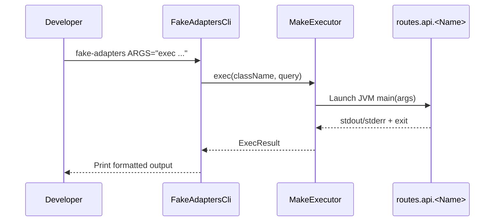

# cgiplus.java

A tiny Java playground that emulates old-school CGI by running each route in its own JVM. The core
process only hosts a lightweight HTTP server and a background job queue—the interesting work lives in
regular Java classes under `src/routes/api` that communicate with the host through process I/O.

<p align="center">
  
</p>

## Architecture overview



## Requirements

- Java 17+ (the server uses the built-in `com.sun.net.httpserver.HttpServer`)
- `make`

No external dependencies are required. The first build compiles everything in `src/` into `build/` and
reuses that output for subsequent requests.

## Quick start

```bash
make serve
```

The command compiles the project and starts the server on `http://localhost:8080`. Stop it with
<kbd>Ctrl</kbd>+<kbd>C</kbd>. Remove compiled artifacts with `make clean`.

The demo page at `static/index.html` is served from `/` and shows both synchronous and asynchronous
flows. Any other request under `/` tries to read from the `static/` folder first and then falls back
to invoking a synchronous page route (for example `/hello` runs `routes.pages.Hello`).

## Testing the fake adapters from the CLI

`FakeAdaptersCli` offers a tiny command line harness for the fake adapters. Compile the project with
`make compile` (or allow other targets to compile it automatically) and then use the `fake-adapters`
target to invoke the helper:

```bash
# Exercise FakeHttpServerAdapter.start() without spinning up a real server
make fake-adapters ARGS="http --port 9090"

# Run FakeMakeExecutor through JobService.execSync() with queued results
make fake-adapters ARGS="exec --enqueue 0 '{\"ok\":true}' '' routes.api.Echo msg=hi"
```

### Entrypoint sequence diagrams

#### Server startup (`make serve` → `Main`)



#### Synchronous routes (`/api/...`)



#### Static assets and page routes (`/`)



#### Asynchronous jobs (`/api/job/...`)



#### Fake adapters CLI (`make fake-adapters`)



Run `make fake-adapters ARGS="help"` to see the available options.

## Synchronous routes (`/api/...`)

* Path mapping: `/api/<name>` loads the class `routes.api.<Name>` (lowercase-to-Pascal conversion).
  `/api/echo` therefore executes `routes.api.Echo`.
* Entry point: each route must expose `public static void main(String[] args)`.
* Request body: the HTTP adapter persists the body (if present) to `build/post/<uuid>.txt` and appends
  its path as `__post=<file>` in the query string argument passed to the route.
* Response contract: print a JSON payload to `stdout`. The adapter forwards the text directly to the
  client. A non-zero exit status triggers a `500` response with the captured `stderr` output.

Examples:

```bash
# GET example
curl "http://localhost:8080/api/echo?msg=hello"

# POST example (body path available via __post)
curl -X POST "http://localhost:8080/api/echo?from=post" \
     -H "Content-Type: application/json" \
     -d '{"message":"hi"}'
```

### Adding a synchronous route

1. Create `src/routes/api/MyRoute.java` with a `main` method that reads the query string argument.
2. Emit the desired JSON on `stdout` and exit with `0`.
3. Invoke it via `/api/myRoute`. The host process recompiles automatically on the next request if
   the class already exists in `build/`.

You can also execute a route manually with `make run CLASS=routes.api.MyRoute Q="foo=bar"`.

## Page routes and static assets (`/`)

* When a client requests a path under `/`, the HTTP adapter first checks for a matching file within
  the `static/` directory (normalizing the path to prevent traversal). Files stream directly to the
  client with the detected or inferred content type.
* If no static asset exists, the adapter converts the URL segments to PascalCase and invokes the
  corresponding `routes.pages.<Name>` class via `JobService.execSync(...)`.
* Page routes behave like synchronous API routes but typically emit HTML. They receive the raw query
  string in `args[0]` and should print the rendered markup to `stdout`.

Example:

```bash
curl "http://localhost:8080/hello?name=Visitor"
```

### Adding a page route

1. Create `src/routes/pages/MyPage.java` with a `public static void main(String[] args)` entry point.
2. Parse the query string (available as `args[0]`) and print your HTML payload to `stdout`.
3. Visit `/myPage` in the browser. If the class already exists in `build/`, the next request
   recompiles automatically.

## Asynchronous jobs (`/api/job/...`)

`JobService` maintains a small worker pool that executes the same route classes in the background.
Requests return immediately with tracking metadata while the job runs in a separate process.

Endpoints:

| Endpoint | Description |
| --- | --- |
| `GET /api/job/start?name=<route>` | Enqueues `routes.api.<Route>` and returns `{ jobId, sid, state }`. |
| `GET /api/job/start?class=<fqcn>` | Alternative form that bypasses the naming convention. |
| `GET /api/job/status?id=<jobId>` | Reports state, exit code, and timing information. |
| `GET /api/job/output?id=<jobId>` | Streams the captured `stdout` once available. |

All start requests copy the HTTP body to disk and augment the worker query string with `__post` and
`__sid` (the optional stable identifier supplied via `sid=`). Job artifacts live under `build/jobs/`.

Example flow:

```bash
# Start an async job (runs routes.api.LongDemo for ~3 seconds).
# Requires jq for parsing; substitute your preferred JSON parser if needed.
JOB=$(curl -s "http://localhost:8080/api/job/start?name=longDemo&seconds=3" | jq -r .jobId)

# Poll status until DONE
curl "http://localhost:8080/api/job/status?id=$JOB"

# Inspect stdout once finished
curl "http://localhost:8080/api/job/output?id=$JOB"
```

## Project layout

```
.
├── Makefile             # build, serve, run, and clean targets
├── static/
│   └── index.html       # in-browser demo for sync/async flows
└── src/
    ├── Main.java        # wires the HTTP adapter and job service
    ├── adapters/
    │   ├── in/http/HttpServerAdapter.java
    │   └── out/process/MakeExecutor.java
    ├── app/
    │   ├── JobService.java
    │   └── QueryUtil.java
    ├── domain/
    │   ├── Job.java
    │   └── JobState.java
    ├── org/json/        # minimal JSONObject helper
    ├── ports/
    │   └── RouteExecutorPort.java
    └── routes/api/
        ├── Echo.java
        └── LongDemo.java
```

Happy hacking!
